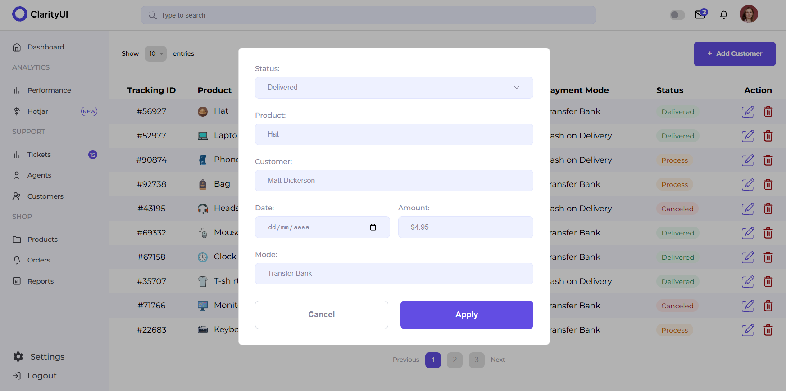
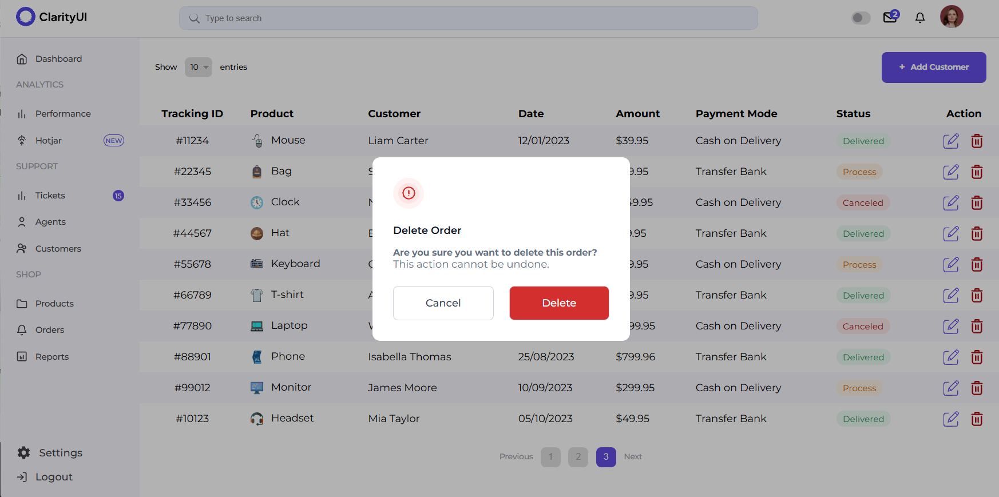
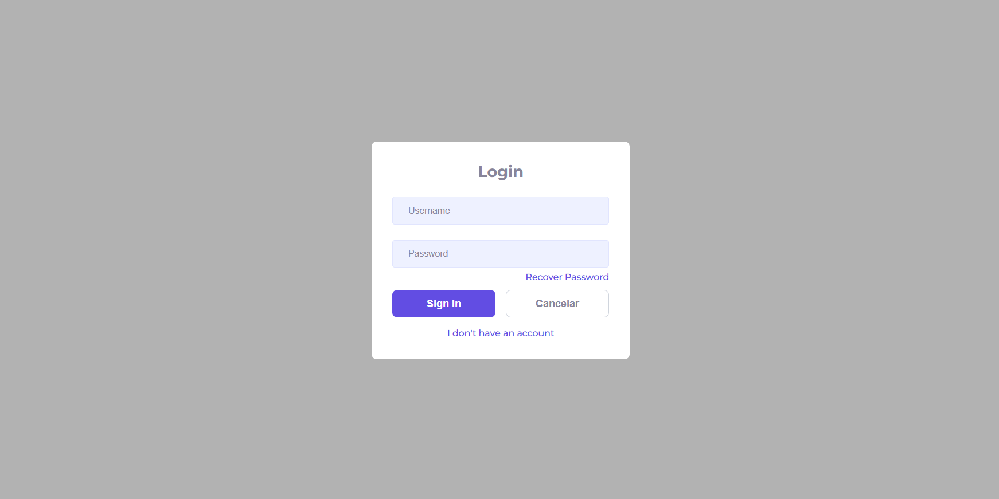
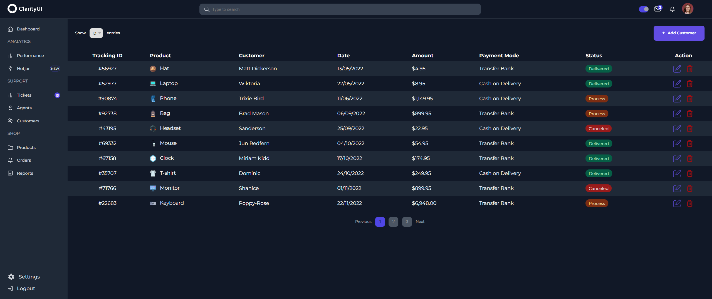

**Desafio Técnico - Desenvolvedor Front-end Pleno**

## Como Rodar o Projeto Localmente

### Pré-requisitos
- **Node.js** (versão 14 ou superior)
- **NPM** ou **Yarn**
- **JSON Server**

### Passo a Passo

1. Clone o repositório:
   ```bash
   git clone https://github.com/DaviCastanha/vue2-dashboard.git
   cd vue2-dashboard

2. Instale as dependências:
   ```bash
   npm install

3. Inicie o JSON Server:
   ```bash
   npm run json-server 

   ou 
   
   npm json-server --watch db.json --port 3000

4. Inicie o servidor de desenvolvimento:
   ```bash
   npm run serve

5. Acesse o projeto no navegador:
    [http://localhost:8080](http://localhost:8080)

    Certifique-se de acessar "Products" e "Login" na sidebar, ou adicionar /products e /login no link.

## O que foi feito neste projeto?

Este projeto foi desenvolvido com foco nos seguintes critérios:

- **Fidelidade ao design**: A dashboard foi replicada com base no design do Figma.
- **Diferenciais implementados**: Funcionalidades extras como animações, toasts e modo dark/light foram adicionadas.
- **Boas práticas de desenvolvimento**: Código organizado, componentização inteligente e uso eficiente de CSS.
- **Uso correto do Vue.js**: Componentes reutilizáveis e rotas configuradas.
- **Conexões HTTP**: Requisições simuladas com JSON Server e Axios.

## Prints do Projeto

### /products


### Modal de Criação e Edição


### Confirmação de Exclusão


### /login


### Modo Dark


## Introdução

Bem-vindo ao desafio técnico! Este projeto foi desenvolvido para avaliar habilidades em Vue.js, CSS puro e boas práticas de desenvolvimento. O objetivo foi criar uma dashboard fiel ao design disponibilizado no Figma, garantindo qualidade, interatividade e um código bem estruturado.

---

## Descrição do Desafio

O desafio consistiu em desenvolver uma dashboard baseada no design fornecido no Figma. A tarefa incluiu a criação de componentes reutilizáveis, rotas, uma API fake para simular métodos HTTP e a implementação de funcionalidades como paginação e filtro de itens por página.

**Link do Figma:**  
[Design no Figma](https://www.figma.com/design/MY0oUHkutSQkxqQCIGuwrx/Teste-T%C3%A9cnico-%7C-Front-End?node-id=0-1&m=dev&t=73xLTQ1HDiQfeS9C-1)

---

## Funcionalidades Implementadas

### Requisitos Obrigatórios
- [x] Utilização do **Vue.js** (versão 2).
- [x] Criação de rotas (ex.: rota "Products" para a tabela).
- [x] API fake utilizando **JSON Server** para simular métodos HTTP (`GET`, `POST`, `PUT`, `DELETE`).
- [x] Componentes reutilizáveis.
- [x] Paginação e filtro de itens por página.
- [x] Requisições HTTP com **Axios**.
- [x] Estilização com **CSS puro** (sem frameworks como Bootstrap ou Tailwind).
- [x] Uso eficiente de **CSS Grid** e **Flexbox**.
- [x] Boas práticas de acessibilidade (ex.: uso de `aria-labels`).
- [x] Código organizado e legível.

### Diferenciais Implementados
- [x] Animações sutis com **CSS transitions**.
- [x] Toasts para ações (ex.: sucesso ou erro nas operações).
- [x] Tela de Login e Logout (sem autenticação JWT).
- [x] Modo **dark/light**.
- [x] Texto ou aviso para outras rotas.

---

Aprecio a oportunidade, foi um excelente desafio!


